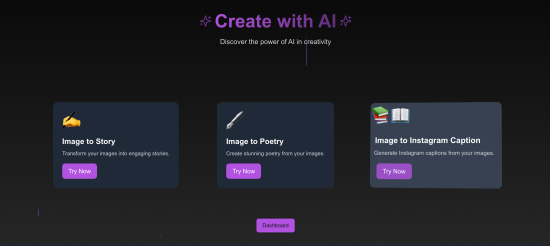

<div align="center">

<a href="https://astitva-frontend.yashrajn.com/" target="_blank" title="Visit Us"></a>


<a name="readme-top"></a>

# Astitva

Astitva is an AI-driven platform that transforms images into captivating stories, heartfelt poems, and creative captions. Built with Python Flask and Next.js/React, it leverages Worqhat APIs to demonstrate the boundless creativity of artificial intelligence. Astitva is designed to inspire and showcase AI's potential in storytelling, poetry, and social media engagement.

> #### ⚠ Due to cloudflare timeout issues, the hosted url will not work. Please Self Host the project to use it.


[](./LICENSE)


<a href="https://astitva-frontend.yashrajn.com/" target="_blank" title="Visit Us">
<del>Check out Astitva</del>
</a>

---
<div align="center">

## Key Features
 
<div align="left">

1. **Image-to-Story Generation**  
   - Transforms images into immersive, context-aware stories.  
   - Generates chapters with themes like mystery, thriller, or drama.  
   - Maintains plot continuity and incorporates character backstories.  

2. **Image-to-Poem Generation**  
   - Creates meaningful poems inspired by the image's mood, theme, and setting.  
   - Uses cues like solitude, love, or nature to craft unique, emotional expressions.  

3. **Image-to-Caption Generation**  
   - Generates engaging captions tailored to the image.  
   - Suggests keywords and hashtags for social media visibility.  

4. **Context Awareness**  
   - Ensures continuity across story chapters and thematic alignment in poems.  
   - Delivers human-like, consistent, and creative outputs.  

5. **API Integration**  
   - Powered by **Worqhat APIs** for accurate and efficient creative processing.  

6. **Showcasing AI Creativity**  
   - Demonstrates AI’s ability to transform static images into stories, poems, and captions.  
   - Highlights AI as a creative collaborator bridging art and technology.  

Astitva redefines creativity by merging artificial intelligence with storytelling, poetry, and content creation.

---

<div align="center">

## Workflow


<div align="left">

1. **Upload Image:**
   - Users provide an image to initiate the creative process.

2. **AI Theme Analysis:**
   - The AI identifies themes such as mystery, sadness, or joy based on image context.

3. **Content Generation:**
   - **Stories:** Chapter-based narratives crafted from the image’s themes and settings.
   - **Poems:** Emotion-rich poetry inspired by the image’s mood.
   - **Captions:** Keywords and captions tailored for social media use.

4. **Result Presentation:**
   - Generated content is presented in an intuitive and creative format for the user.

---

<div align="center">

## Tech Stack

<div align="center">

### Backend
<div align="left">

   - **Python Flask:** Core framework for server-side logic and API handling.
   - **WorqHat APIs:** Enables advanced AI capabilities for creative content generation. (Special mention to WorqHat for their support.)

<div align="center">

### Frontend
<div align="left">

   - **Next.js (React):** Provides a seamless and interactive user interface.
   - **Tailwind CSS:** Facilitates responsive design and modern styling.
   - **Chakra UI:** Offers a component library for consistent design elements.
   - **Aceternity:** Provides a clean and aesthetic design theme.
   - **Shadcn/ui:** Offers a custom UI library for enhanced user experience.
   - **Clerk:** Provides authentication and user management capabilities.

---

<div align="center">

## Installation

<div align="center">

### Prerequisites
<div align="left">

   - Python 3.7+
   - Node.js 16+

1. **Clone the Repository:**
   ```bash
   git clone https://github.com/your-repo/astitva.git
   cd astitva
   ```

2. **Set Up Backend:**
   - Install dependencies:
     ```bash
     pip install -r requirements.txt
     ```
   - Run the Flask server:
     ```bash
     python main.py
     ```

3. **Set Up Frontend:**
   - Navigate to the `frontend` folder:
     ```bash
     cd frontend
     ```
   - Install dependencies:
     ```bash
     npm install
     ```
   - Start the development server:
     ```bash
     npm run dev
     ```

4. **Configure Environment Variables:**
   - Set up API keys and endpoints for WorqHat APIs in a `.env` file.
   - Ensure Clerk API key is added in the `.env.local` file for frontend usage.
   - Rename `env.example` files to `.env` for backend and `.env.local` for frontend.

---

<div align="center">

## Usage
<div align="left">

1. Open the application at `http://localhost:3000`.
2. Upload an image of your choice.
3. Choose the desired output type:
   - **Story**: Get a detailed narrative.
   - **Poem**: Receive a poetic creation.
   - **Caption**: Generate social media-ready captions.
4. Enjoy and save your AI-generated content!

---

<div align="center">

## Screenshots




---

<div align="center">

## Credits
<div align="left">

- **WorqHat APIs:** Acknowledgment for providing robust AI capabilities.
- **CSI @ MIT-WPU:** For organising an amazing hackathon.


---

<div align="center">

## License

This project is licensed under the MIT License. See the `LICENSE` file for more details.
